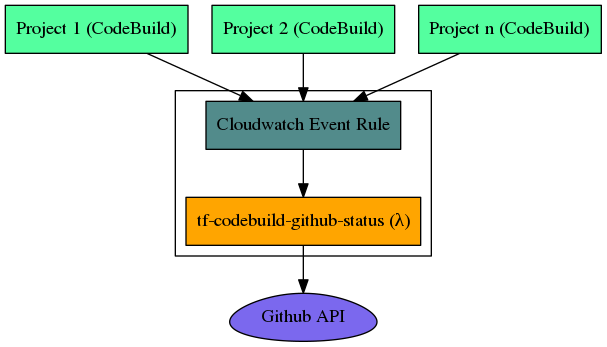

# tf-codebuild-github-status
a `node.js` lambda function that updates `github` PR statuses based on `codebuild` events

<p align="center">

</p>

## Requirements
- [Node.js](https://nodejs.org) `>= 24.4.0` (see [.nvmrc](./.nvmrc)), or [Docker & Compose](https://docs.docker.com/compose/)

The codebase is written as native ES modules (`"type": "module"`) and runs on Node.js 24 without any transpilation. Configuration is fetched from SSM using the AWS SDK for JavaScript v3 (`@aws-sdk/client-ssm`), which is provided by the `nodejs24.x` lambda runtime.

## Installing
```shell
# clone the repo and install dependencies
$ git clone git@github.com:cludden/tf-codebuild-github-status.git
$ cd tf-codebuild-github-status
$ npm install
```

## Contributing
1. Clone it (`git clone git@github.com:cludden/tf-codebuild-github-status.git`)
1. Create your feature branch (`git checkout -b my-new-feature`)
1. Commit your changes using [conventional changelog standards](https://github.com/bcoe/conventional-changelog-standard/blob/master/convention.md) (`git commit -m 'feat(my-new-feature): Add some feature'`)
1. Push to the branch (`git push origin my-new-feature`)
1. Ensure linting/security/tests are all passing
1. Create new Pull Request

## Testing
```shell
# run test suite
$ npm test

# run test suite and generate code coverage
$ npm run coverage

# run linter (eslint flat config, see eslint.config.js)
$ npm run lint

# run security scan of production dependencies
$ npm run sec
```

Or via docker:
```shell
# run test suite and generate code coverage
$ docker-compose run tf-codebuild-github-status

# run linter
$ docker-compose run tf-codebuild-github-status npm run lint
```

## Building
Bundles the function into `dist/index.js` using [esbuild](https://esbuild.github.io/). The AWS SDK v3 is excluded from the bundle because the lambda runtime provides it.
```shell
# bundle only
$ npm run build

# bundle and produce the deployable artifact dist/index.zip
# (index.js must sit at the zip root — the lambda handler is "index.handler")
$ npm run package
```

## Releasing
`master` is protected (PR-only, linear history), so the release tool must never create the tag itself: a tag made on a branch dangles once the PR is squash-merged, because the squash commit gets a new SHA. Version on a branch, then tag `master` after the merge.

1. Ensure everything is green: `npm run lint && npm test && npm run sec`
1. On a release branch, run `npm run release -- --skip.tag true` — bumps `package.json`/`package-lock.json` and the [CHANGELOG](./CHANGELOG.md) and commits, but does **not** tag. If the automatic bump picks the wrong version, add `--release-as X.Y.Z` (the version must be higher than every existing tag — the tag line is already past `v2.0.0`)
1. Push the branch, open a PR to `master`, and squash-merge it
1. Tag the squash commit on master and push the tag:
    ```shell
    $ git fetch origin
    $ git tag -a vX.Y.Z -m "chore(release): X.Y.Z" origin/master
    $ git push origin vX.Y.Z
    ```
1. Build the artifact and upload it to the shared ops artifacts bucket under a **new version path** (the bucket name is in the S3 console or the `s3-artifacts-ops-<region>` TFE workspace outputs):
    ```shell
    $ npm run package
    $ aws s3 cp dist/index.zip s3://<artifacts-bucket>/tf-codebuild-github-status/vX.Y.Z/index.zip
    ```
1. [Publish a release](https://help.github.com/articles/creating-releases/) in github using the CHANGELOG notes
1. Deploy via Terraform Enterprise (see [Deploying](#deploying))

## Configuring
Define custom configuration
```json
{
  "github": {
    "url": "https://api.github.com",
    "owner": "my-org",
    "token": "xxxxxxxx"
  },
  "log": {
    "level": "info"
  }
}
```

Add JSON configuration to ssm
```shell
$ aws ssm put-parameter --name /secrets/codebuild-trigger/custom --type SecureString --value $JSONCONFIG
```

## Deploying
Our lambda is deployed by a **Terraform Enterprise workspace** that runs this repo's `terraform/` directory directly as a root module — from the **`terraform-enterprise` branch**, not from `master`. That branch carries the modern (0.12+) syntax, pins `required_version >= 1.4.2` and `hashicorp/aws >= 6.0`, and sets the lambda runtime (`nodejs24.x`). The workspace supplies `name`, `region`, `config_parameter_names`, `s3_bucket`, `s3_key`, and AWS credentials (`access_key`/`secret_key`, from the org variable set) as Terraform variables.

To deploy a new code version:
1. Complete the [release steps](#releasing) so the artifact exists at `tf-codebuild-github-status/vX.Y.Z/index.zip` in the artifacts bucket
1. Update the workspace's `s3_key` variable to the new version path. The `aws_lambda_function` resource has no `source_code_hash`, so **changing `s3_key` is what triggers the code redeploy** — re-uploading to the same key deploys nothing
1. Queue a plan and read it before applying: a code-only deploy should show one in-place update of the lambda function and **0 to destroy**
1. Verify from the Lambda console (Test tab):
    - a non-PR event `{ "detail": { "additional-information": { "source-version": "v1.0.0" } } }` should succeed with `"event:success"` — proves runtime, bundle, and SSM config
    - the fixture [test/fixtures/build-state-change.json](./test/fixtures/build-state-change.json) should **fail with a GitHub 404** for `my-repo` — that is the pass signal, proving the GitHub client authenticated with the token from SSM (a 401/403 means the token needs rotating)

Terraform *module* changes (anything under `terraform/`) also belong on the `terraform-enterprise` branch. Other repos (e.g. `tf-buildpipeline`) consume `terraform/` as a module pinned to immutable git refs (`//terraform?ref=v1.0.2`, `ref=terraform-1.x.x-compatible`) — never move or rewrite those tags/branches; existing consumers resolve them live.

For reference, consuming this as a module from another root looks like:
```
module "codebuild_trigger" {
  source                 = "git::git@github.com:Mindflash/tf-codebuild-github-status.git//terraform?ref={version}"
  config_parameter_names = "/secrets/codebuild-trigger"
  memory_size            = 128
  name                   = "codebuild-github-status"
  node_env               = "production"
  region                 = "us-east-1"
  s3_bucket              = "my-artifact-bucket"
  s3_key                 = "tf-codebuild-github-status/${var.version}/index.zip"
  timeout                = 10
}
```

Note: AWS Lambda manages patch versions within a runtime family, so patch-level pinning (for example, `24.4.0`) is not configurable in Terraform.

## License
Licensed under the [MIT License](LICENSE.md)

Copyright (c) 2017 Chris Ludden
